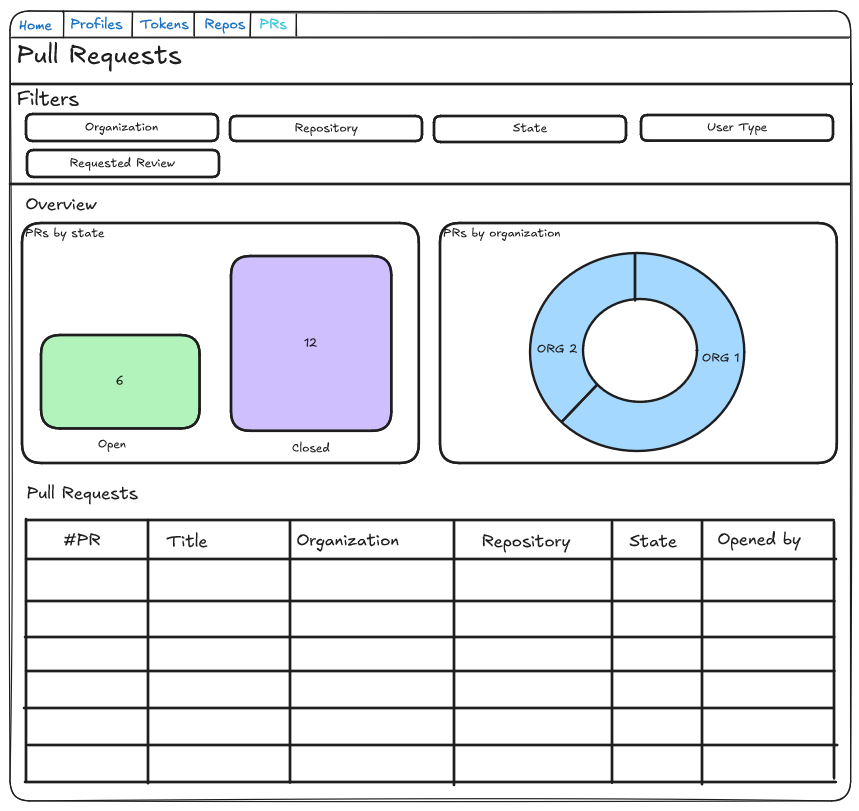

# Project Outline - V1

The project will should allow users to do the following things in the V1 release:

- List all pull requests for the repos they specify.
    - They will have the following fields shown:
        - PR ID and link
        - Organization
        - Repository
        - State
        - Title
        - PR opener
    - Two charts
        - PRs by state
        - PRs by organization
    - The user will be allowed to filter out repositories based on different fields, they should be able to filter by:
        - Organization
        - Repository
        - State (Open by default)
        - User type of pull request creator (User by default)
        - If you have been assigned a reviewer. (True by default)
    - The should also be allowed to sort the results.
- View the details of a specific pull request.
    - There should be the following elements on this page
        - Heading with the title of the PR
        - Card with the state
        - Card with the PR opener
        - Card with number of commits
        - Card with number of additions
        - Card with number of deletions
        - Card with changed files
        - Tab Component
            - PR reviewers
            - Line chart with commit overview
        - Tab Component
            - Conversation/Comments panel
            - Conversation/Reviews panel

## Setting up users

Users will be able to create "GitHub Profiles" associated to their account/user. These GitHub Profiles will align to a existing GitHub profile.

This is to allow users to create different profiles for work and personal accounts as an example.

These will require the following fields:

- ID (primary key)
- Name (Ex. Evanlab02)
- Project user (foreign key)

### Setting up tokens

The API will force using GH tokens to request data from the API.

Therefore you will need to create records with the GitHub API tokens. You can create your own names for these.

- ID (Primary key)
- Name (Ex. My personal token/My work token)
- Token (The GH token)
- Project user (foreign key)

### Setting up synchronized repositories

You will also need to tell the API which repositories it should use. This will link to your profile and tokens. The profile part will enable us to differentiate things like comments indicating your comments different than other users comments.

- ID (Primary key)
- Organization (Ex. Evanlab02)
- Repository (Ex. GitTogether)
- GitHub Profile (Foreign Key)
- GitHub Token (Foreign Key)
- Project user (foreign key)

## Pull requests - List View

